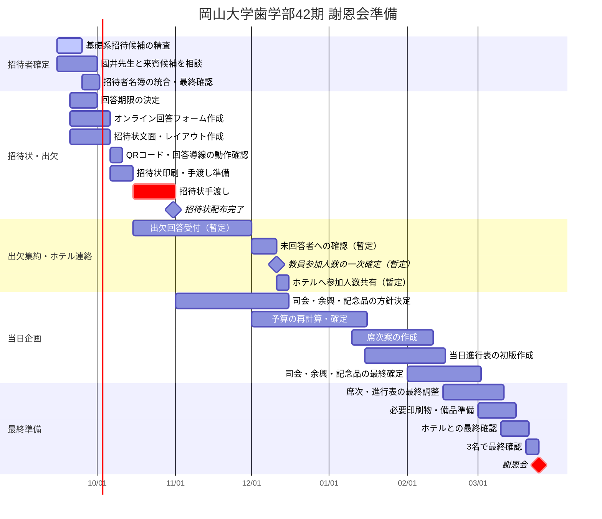

# 謝恩会準備 ガントチャート

最終更新: 2026-09-15

このファイルは、2027年3月25日の謝恩会に向けた作業スケジュールを管理する。

> 重要: 2026年10月中の招待状手渡しまでは比較的確度の高い予定。11月以降は現時点での暫定案であり、ホテル側の締切、園井先生との相談、出欠回答期限の決定後に更新する。

## 運営メンバー

- 前田
- 金子
- 石鍋

現時点では3名共同進行。個別担当が決まり次第、このファイルへ反映する。

## 全体ガントチャート

## タスク一覧

| 時期 | タスク | 担当 | 状況 | 備考 |
|---|---|---|---|---|
| 9月 | 基礎系教員の招待候補確定 | 3名共同 | 進行中 | 学生教育への実質的関与を重視 |
| 9月 | 園井先生と来賓候補を相談 | 3名共同 | 未着手 | 来賓は未定 |
| 9月末目安 | 出欠回答期限を決定 | 3名共同 | 未決定 | 招待状作成前に確定したい |
| 9月〜10月上旬 | オンライン回答フォーム作成 | 3名共同 | 未着手 | QRコードから回答 |
| 9月〜10月上旬 | 招待状文面・レイアウト作成 | 3名共同 | 未着手 | 10月中手渡しが必須 |
| 10月 | 招待状印刷・手渡し | 3名共同 | 未着手 | 10月31日までを目標 |
| 10月〜11月 | 出欠回答の収集 | 3名共同 | 未着手 | 回答期限は要決定 |
| 12月頃 | 未回答者への確認・人数整理 | 3名共同 | 暫定 | 実際の日程は回答期限次第 |
| 12月頃 | ホテルへ参加人数共有 | 3名共同 | 暫定 | ホテル側の締切確認が必要 |
| 11月〜2月 | 司会・余興・記念品の決定 | 3名共同 | 未着手 | 担当分け推奨 |
| 12月〜1月 | 予算確定 | 3名共同 | 未着手 | 教員参加人数確定後に精度向上 |
| 1月〜2月 | 席次作成 | 3名共同 | 未着手 | 出欠確定後 |
| 1月〜3月 | 当日進行表作成 | 3名共同 | 未着手 | 司会・余興決定と連動 |
| 3月 | 印刷物・備品・ホテル最終確認 | 3名共同 | 未着手 | ホテル指定期限を確認後に修正 |
| 3月25日 | 謝恩会本番 | 3名共同 | 未着手 | 19:00開始予定 |

## 次に確定すべき期限

1. 基礎系招待候補の確定日
2. 園井先生との相談日
3. 出欠回答期限
4. ホテル側が求める「一次人数」「最終人数」の連絡期限
5. 司会・余興・記念品の担当割り振り

この5点が決まると、11月以降のガントチャートの精度を大きく上げられる。
