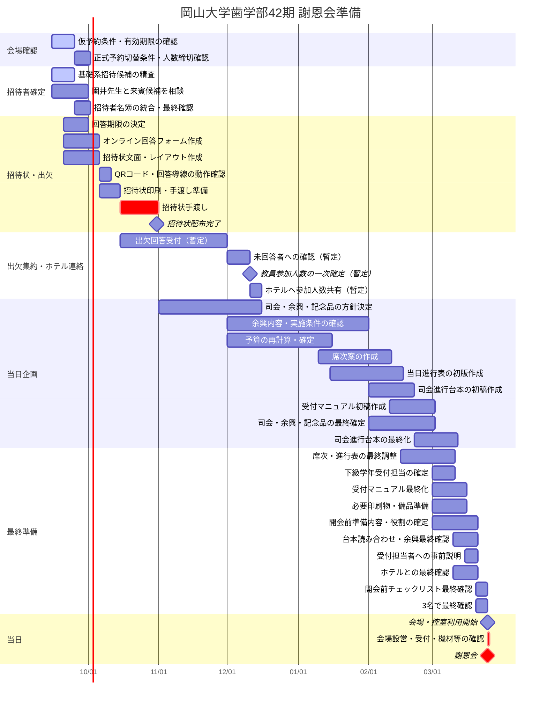

# 謝恩会準備 ガントチャート

最終更新: 2026-09-15

このファイルは、2027年3月25日の謝恩会に向けた作業スケジュールを管理する。

> 重要: 2026年10月中の招待状手渡しまでは比較的確度の高い予定。11月以降は現時点での暫定案であり、ホテル側の締切、園井先生との相談、出欠回答期限の決定後に更新する。

## 運営メンバー

- 前田
- 金子
- 石鍋

現時点では3名共同進行。個別担当が決まり次第、このファイルへ反映する。

## 全体ガントチャート

## タスク一覧

| 時期 | タスク | 担当 | 状況 | 備考 |
|---|---|---|---|---|
| 9月 | ホテル仮予約の有効期限確認 | 3名共同 | 未確認 | 確認書には「要相談」と記載 |
| 9月 | 正式予約への切替条件・人数連絡期限確認 | 3名共同 | 未確認 | 一次人数・最終人数の締切を確認する |
| 9月 | 基礎系教員の招待候補確定 | 3名共同 | 進行中 | 学生教育への実質的関与を重視 |
| 9月 | 園井先生と来賓候補を相談 | 3名共同 | 未着手 | 来賓は未定 |
| 9月末目安 | 出欠回答期限を決定 | 3名共同 | 未決定 | 招待状作成前に確定したい |
| 9月〜10月上旬 | オンライン回答フォーム作成 | 3名共同 | 未着手 | QRコードから回答 |
| 9月〜10月上旬 | 招待状文面・レイアウト作成 | 3名共同 | 未着手 | 10月中手渡しが必須 |
| 10月 | 招待状印刷・手渡し | 3名共同 | 未着手 | 10月31日までを目標 |
| 10月〜11月 | 出欠回答の収集 | 3名共同 | 未着手 | 回答期限は要決定 |
| 12月頃 | 未回答者への確認・人数整理 | 3名共同 | 暫定 | 実際の日程は回答期限次第 |
| 12月頃 | ホテルへ参加人数共有 | 3名共同 | 暫定 | ホテル側の締切確認後に修正 |
| 11月〜12月 | 司会・余興・記念品の方針決定 | 3名共同 | 未着手 | 担当分け推奨 |
| 12月〜1月 | 余興内容の確認 | 3名共同 | 未着手 | 内容、所要時間、必要機材、ホテル側の制約、担当者を確認 |
| 12月〜1月 | 予算確定 | 3名共同 | 未着手 | 教員参加人数確定後に精度向上 |
| 1月〜2月 | 席次作成 | 3名共同 | 未着手 | 出欠確定後 |
| 1月〜3月 | 当日進行表作成 | 3名共同 | 未着手 | 司会・余興決定と連動 |
| 2月 | 当日の司会進行台本を作成 | 3名共同 | 未着手 | 開会、挨拶、乾杯、歓談、余興、記念品、閉会等を時系列化 |
| 2月中旬〜3月 | 受付マニュアル作成 | 3名共同 | 未着手 | 下級学年の謝恩会委員向け。受付手順・来賓対応・トラブル対応を明記 |
| 2月末〜3月 | 司会進行台本の最終化 | 3名共同 | 未着手 | 登壇者名、肩書、所要時間、転換コメントまで確定 |
| 3月上旬 | 下級学年の受付担当者・人数を確定 | 3名共同 | 未着手 | 集合時刻・役割も同時に確定 |
| 3月上旬 | 開会前準備内容・役割の確定 | 3名共同 | 未着手 | 受付、会場設営、控室、機材、配布物、進行確認等を具体化 |
| 3月中旬 | 受付担当者への事前説明 | 3名共同 | 未着手 | マニュアルを使って当日の流れとイレギュラー対応を共有 |
| 3月中旬 | 台本読み合わせ・余興最終確認 | 3名共同 | 未着手 | 尺、機材、入退場、BGM・映像、ホテルとの連携を確認 |
| 3月中旬 | 開会前チェックリスト作成・最終確認 | 3名共同 | 未着手 | 当日17:00〜19:00の準備を時系列で確認できる形にする |
| 3月 | 印刷物・備品・ホテル最終確認 | 3名共同 | 未着手 | ホテル指定期限を確認後に修正 |
| 3月25日 17:00 | 会場・控室利用開始 | 3名共同 | 予定 | 宴会場「宙」、控室「延養 I・II」 |
| 3月25日 17:00〜19:00 | 開会前準備・最終確認 | 3名共同 | 予定 | 会場設営、受付、席次、名札・配布物、音響映像、司会・進行、控室、記念品等を確認 |
| 3月25日 19:00 | 謝恩会開始 | 3名共同 | 予定 | 会場利用は21:00まで |

## 会場予約で確認済みの前提

- ANAクラウンプラザホテル岡山 19F「宙」280㎡を仮予約。
- 確認書上の会場人数は100名。
- 19F「延養 I」「延養 II」（各20㎡）を控室として確保。
- 会場・控室ともに利用時間は17:00〜21:00。
- 仮予約の有効期限は確認書上「要相談」。

## 開会前準備で確認する項目（暫定）

- 受付設営と出席者名簿・芳名帳等の準備
- 席次・テーブル配置・席札等の最終確認
- 会場内の案内表示、配布物、記念品等の配置
- マイク、BGM、映像、PC、プロジェクター等の動作確認
- 司会者・挨拶者・余興担当者との進行確認
- 司会進行台本の最新版が共有されているか確認
- 余興の必要機材・データ・入退場動線の最終確認
- 教員・来賓控室の状態確認
- ホテル担当者との料理・飲料・サービス開始時刻等の最終確認
- 運営3名および当日協力者の役割分担・連絡方法の確認
- 受付担当者への引き継ぎと受付開始準備
- 19:00開会に向けた最終タイムチェック

この項目は当日進行表・会場レイアウトが固まった段階で具体化し、最終的にはチェックリスト化する。

## 次に確定すべき期限

1. ホテル仮予約の有効期限
2. 正式予約への切替手続き・期限
3. ホテル側が求める「一次人数」「最終人数」の連絡期限
4. 基礎系招待候補の確定日
5. 園井先生との相談日
6. 出欠回答期限
7. 司会・余興・記念品の担当割り振り
8. 余興内容・所要時間・必要機材の確定時期
9. 司会進行台本の初稿・最終版の締切
10. 下級学年受付担当者の確定時期
11. 受付マニュアル完成・事前説明の時期
12. 当日の準備開始から19:00開会までの役割分担

ホテル側の締切が確定すると、11月以降のガントチャートをより正確に組み直せる。
