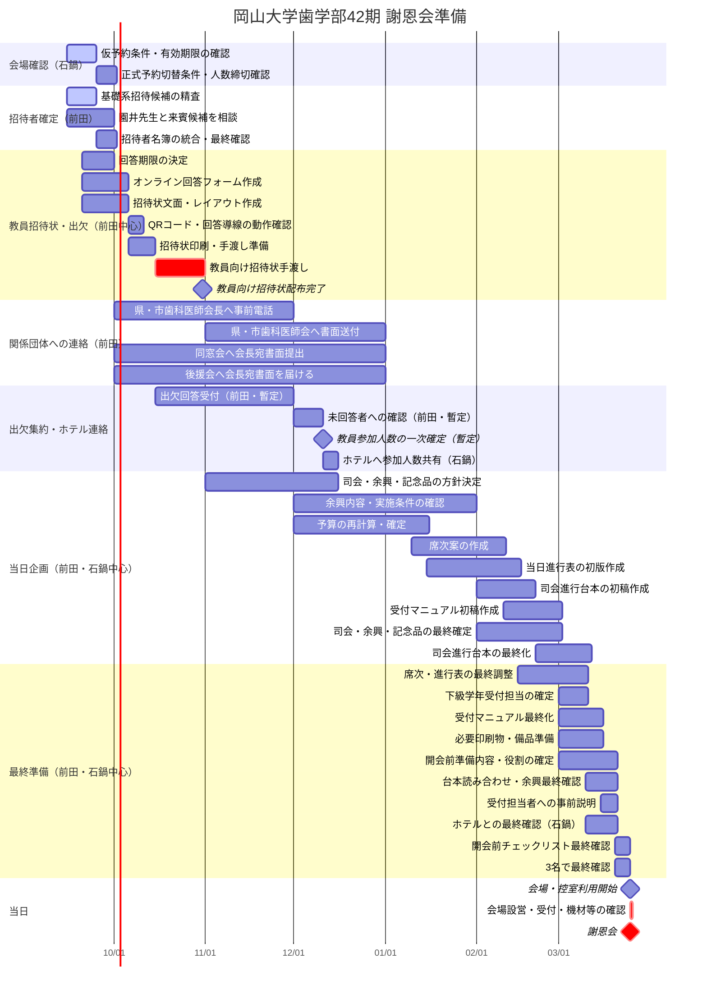

# 謝恩会準備 ガントチャート

最終更新: 2026-09-16

このファイルは、2027年3月25日の謝恩会に向けた作業スケジュールを管理する。

> 重要: 2026年10月中の教員向け招待状手渡しまでは比較的確度の高い予定。教員以外の来賓・関係団体への連絡時期は今回のメールで確認した月単位の目安を反映している。その他の11月以降の日程は現時点での暫定案であり、ホテル側の締切、園井先生との相談、出欠回答期限の決定後に更新する。

## 運営メンバー・分担方針

- **石鍋**：ホテルとのやり取りを主担当。
- **前田**：先生・来賓とのやり取りを主担当。
- **金子**：他のクラス内役職と重複しているため、謝恩会準備では負担を可能な限り小さくし、必要時の確認・相談・補助を中心とする。

ホテル・先生のどちらにも属さない内部作業は、前田・石鍋を中心に分担する。重要な判断は3名で共有・確認する。

## 全体ガントチャート

## タスク一覧

| 時期 | タスク | 主担当 | 状況 | 備考 |
|---|---|---|---|---|
| 9月 | ホテル仮予約の有効期限確認 | 石鍋 | 未確認 | 確認書には「要相談」と記載 |
| 9月 | 正式予約への切替条件・人数連絡期限確認 | 石鍋 | 未確認 | 一次人数・最終人数の締切を確認する |
| 9月 | 基礎系教員の招待候補確定 | 前田 | 進行中 | 学生教育への実質的関与を重視 |
| 9月 | 園井先生と来賓候補を相談 | 前田 | 未着手 | 来賓は未定 |
| 9月末目安 | 出欠回答期限を決定 | 前田中心 | 未決定 | 3名で最終確認 |
| 9月〜10月上旬 | オンライン回答フォーム作成 | 前田中心 | 未着手 | QRコードから回答 |
| 9月〜10月上旬 | 教員向け招待状文面・レイアウト作成 | 前田中心 | 未着手 | 10月中手渡しが必須 |
| 10月 | 教員向け招待状印刷・手渡し | 前田中心 | 未着手 | 必要時は石鍋が補助 |
| 10〜11月頃 | 県歯科医師会長・市歯科医師会長へ学生から事前電話 | 前田 | 未着手 | 書面送付より先に電話する |
| 年内 | 県歯科医師会・市歯科医師会へ書面送付 | 前田 | 未着手 | 事前電話後に各会へ送付 |
| 年内 | 同窓会へ会長宛書面を事務局へ提出 | 前田 | 未着手 | メール回答で年内対応可 |
| 年内 | 後援会へ会長宛書面を届ける | 前田 | 未着手 | 学生側から所定の経路で渡す |
| 時期未定 | 案内状・封筒を担任2名に最終確認 | 前田 | 未着手 | 具体時期は今回のメールでは未指定 |
| 10月〜11月 | 出欠回答の収集 | 前田 | 未着手 | 教員・来賓対応を前田に集約 |
| 12月頃 | 未回答者への確認・人数整理 | 前田 | 暫定 | 実際の日程は回答期限次第 |
| 12月頃 | ホテルへ参加人数共有 | 石鍋 | 暫定 | ホテル側の締切確認後に修正 |
| 11月〜12月 | 司会・余興・記念品の方針決定 | 前田・石鍋 | 未着手 | 金子は必要時の確認・相談 |
| 12月〜1月 | 余興内容の確認 | 前田・石鍋 | 未着手 | ホテル設備条件の確認は石鍋 |
| 12月〜1月 | 予算確定 | 石鍋中心 | 未着手 | 教員参加人数確定後に精度向上 |
| 1月〜2月 | 席次作成 | 前田・石鍋 | 未着手 | 出欠確定後 |
| 1月〜3月 | 当日進行表作成 | 前田・石鍋 | 未着手 | 司会・余興決定と連動 |
| 2月 | 当日の司会進行台本を作成 | 前田・石鍋 | 未着手 | 昨年度台本を参考に作成 |
| 2月中旬〜3月 | 受付マニュアル作成 | 前田・石鍋 | 未着手 | 下級学年の謝恩会委員向け |
| 2月末〜3月 | 司会進行台本の最終化 | 前田・石鍋 | 未着手 | 登壇者名・肩書確認は前田、ホテル進行との調整は石鍋 |
| 3月上旬 | 下級学年の受付担当者・人数を確定 | 前田・石鍋 | 未着手 | 集合時刻・役割も同時に確定 |
| 3月上旬 | 開会前準備内容・役割の確定 | 前田・石鍋 | 未着手 | 金子の当日負担も必要最小限とする |
| 3月中旬 | 受付担当者への事前説明 | 前田・石鍋 | 未着手 | マニュアルを使って当日の流れを共有 |
| 3月中旬 | 台本読み合わせ・余興最終確認 | 前田・石鍋 | 未着手 | 必要時に金子も確認参加 |
| 3月中旬 | 開会前チェックリスト作成・最終確認 | 前田・石鍋 | 未着手 | 当日17:00〜19:00を時系列化 |
| 3月 | 印刷物・備品・ホテル最終確認 | 石鍋中心 | 未着手 | ホテル指定期限を確認後に修正 |
| 3月25日 17:00 | 会場・控室利用開始 | 石鍋中心 | 予定 | 宴会場「宙」、控室「延養 I・II」 |
| 3月25日 17:00〜19:00 | 開会前準備・最終確認 | 前田・石鍋中心 | 予定 | 受付は下級学年委員へ委託。金子の負担は最小限 |
| 3月25日 19:00 | 謝恩会開始 | 3名 | 予定 | 会場利用は21:00まで |

## 今回のメールで新たに確認した連絡方針

- 県・市歯科医師会については、今年は「学生から会長へ事前に電話 → 各会へ書面送付」の順で進める。
- 事前電話の目安は10〜11月頃、書面送付は年内。
- 同窓会は会長宛書面を事務局へ提出し、年内対応でよい。
- 後援会も会長宛書面を年内に届ける。
- 卒業祝賀会の案内状・封筒は担任2名へ最終確認を依頼する方向。具体的な時期は今回のメールでは示されていない。
- 案内用封筒は、正式には洋形の白封筒が想定されるが、白封筒であれば大きな問題にはならないとの回答。

## 会場予約で確認済みの前提

- ANAクラウンプラザホテル岡山 19F「宙」280㎡を仮予約。
- 確認書上の会場人数は100名。
- 19F「延養 I」「延養 II」（各20㎡）を控室として確保。
- 会場・控室ともに利用時間は17:00〜21:00。
- 仮予約の有効期限は確認書上「要相談」。

## 開会前準備で確認する項目（暫定）

- 受付設営と出席者名簿・芳名帳等の準備
- 席次・テーブル配置・席札等の最終確認
- 会場内の案内表示、配布物、記念品等の配置
- マイク、BGM、映像、PC、プロジェクター等の動作確認
- 司会者・挨拶者・余興担当者との進行確認
- 司会進行台本の最新版が共有されているか確認
- 余興の必要機材・データ・入退場動線の最終確認
- 教員・来賓控室の状態確認
- ホテル担当者との料理・飲料・サービス開始時刻等の最終確認
- 運営3名および当日協力者の役割分担・連絡方法の確認
- 受付担当者への引き継ぎと受付開始準備
- 19:00開会に向けた最終タイムチェック

この項目は当日進行表・会場レイアウトが固まった段階で具体化し、最終的にはチェックリスト化する。

## 次に確定すべき期限

1. 石鍋：ホテル仮予約の有効期限
2. 石鍋：正式予約への切替手続き・期限
3. 石鍋：ホテル側が求める「一次人数」「最終人数」の連絡期限
4. 前田：基礎系招待候補の確定日
5. 前田：園井先生との相談日
6. 前田中心：出欠回答期限
7. 前田：担任2名へ案内状・封筒の最終確認を依頼する時期
8. 前田・石鍋：司会・余興・記念品の詳細担当割り振り
9. 前田・石鍋：余興内容・所要時間・必要機材の確定時期
10. 前田・石鍋：司会進行台本の初稿・最終版の締切
11. 前田・石鍋：下級学年受付担当者の確定時期
12. 前田・石鍋：受付マニュアル完成・事前説明の時期
13. 前田・石鍋：当日の準備開始から19:00開会までの役割分担

金子については、他のクラス内役職との重複を考慮し、上記各タスクの主担当には原則置かず、必要時の確認・相談・補助に留める。
